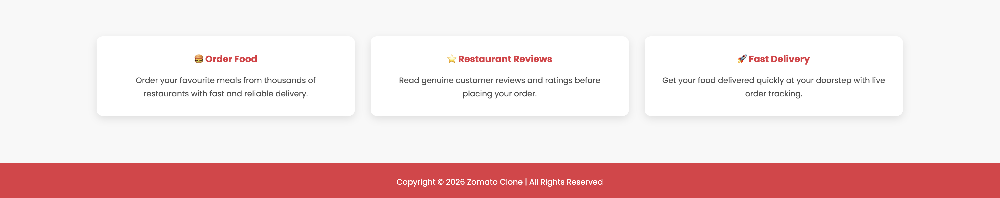

# 🍽️ Zomato Clone

A responsive front-end clone of the Zomato website built using **HTML5, CSS3, and JavaScript**. This project recreates the Zomato landing page with a clean and modern user interface.

## 🚀 Features

- Responsive Design
- Navigation Bar
- Main Section
- Search Bar
- Login Page
- Signup Page
- Add Restaurant Page
- Investor Page

## 🛠️ Tech Stack

- HTML5
- CSS3
- JavaScript

## 📂 Project Structure

📁 Zomato-Clone
 ├── images/
 ├── screenshots/
 ├── index.html
 ├── login.html
 ├── signup.html
 ├── add_restaurant.html
 ├── investor.html
 ├── style.css
 ├── script.js
 └── gitignore

## ▶️ How to Run

1. Clone the repository
   ```bash
   git clone https://github.com/Kanika96sharma/Zomato-Clone.git
   ```

2. Open the project folder.

3. Open `index.html` in your browser.

## 📸 Screenshots





## 👩‍💻 Author

**Kanika Sharma**

GitHub: https://github.com/Kanika96sharma
